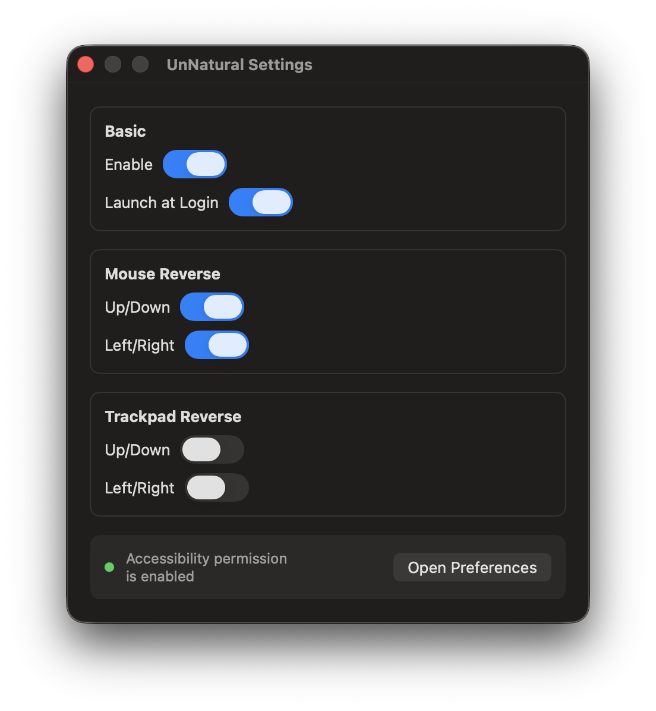

# UnNatural

<p align="center">
  
</p>

UnNatural is a macOS menu bar app that reverses scroll direction separately for mouse and trackpad.

## Screenshot

<p align="center">
  
</p>

## Features

- Lives in the macOS menu bar
- Reverses mouse scrolling when `Mouse` is enabled
- Reverses trackpad scrolling when `Trackpad` is enabled
- Supports launch at login
- Opens the Accessibility permission screen from Settings

## Installation

Download App and place /Applications Directory.
https://github.com/jedipunkz/UnNatural/releases

and set Accessibility permission for `UnNatural.app`

1. Open `UnNatural.app`.
2. Click the UnNatural menu bar icon.
3. Choose `Settings`.
4. Click `Open Preferences`.
5. Enable `UnNatural` in `Privacy & Security > Accessibility`.
6. Enable `Mouse` and/or `Trackpad`.

If scrolling does not change immediately, quit and reopen `UnNatural.app` after granting Accessibility permission.

## Build

You need Xcode to build.

Clone the repository and install the app into `/Applications`.

```bash
git clone https://github.com/jedipunkz/UnNatural.git
cd UnNatural
make install
```

Launch it:

```bash
open /Applications/UnNatural.app
```

Or build, install, and launch in one command:

```bash
make open
```

### Author

jedipunkz

### LICENSE

MIT
